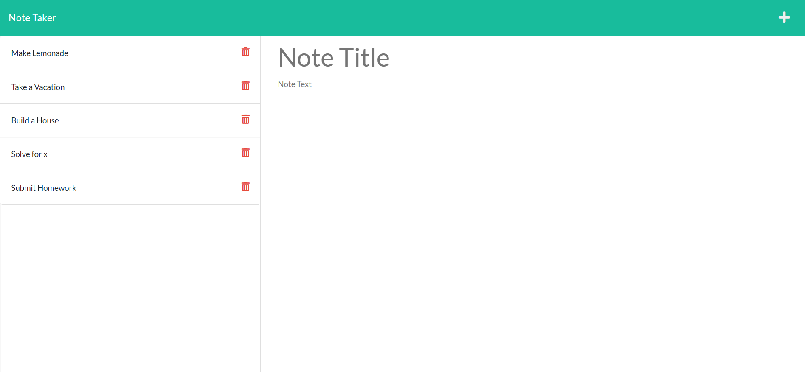

# Express Note Taker

## Description
This app was built to be able to write notes and save them to a server with Express.js

## Installation
This project uses express.js. Run npm install from the command line to install the required dependancies

## Usage
Run npm start from the command line in the root directory of this project to start the server. You can also run node server.js instead.

You can also veiw the deployed application here:
[Note Taker](https://protected-mesa-86289.herokuapp.com/)

## Built With
* Express.js
* node.js
* JavaScript
* HTML
* CSS

## Contribution
Made by Samuel Varney for school. 
